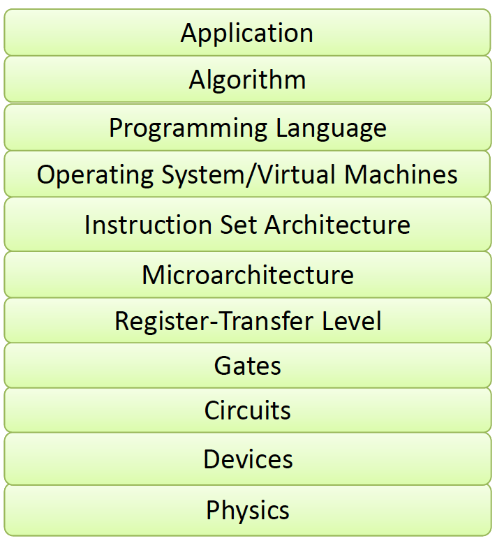
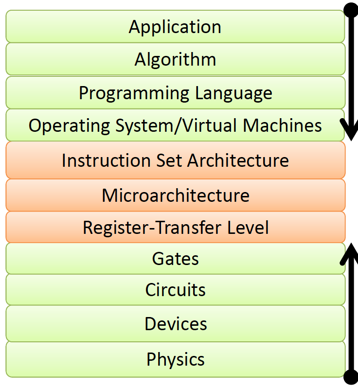
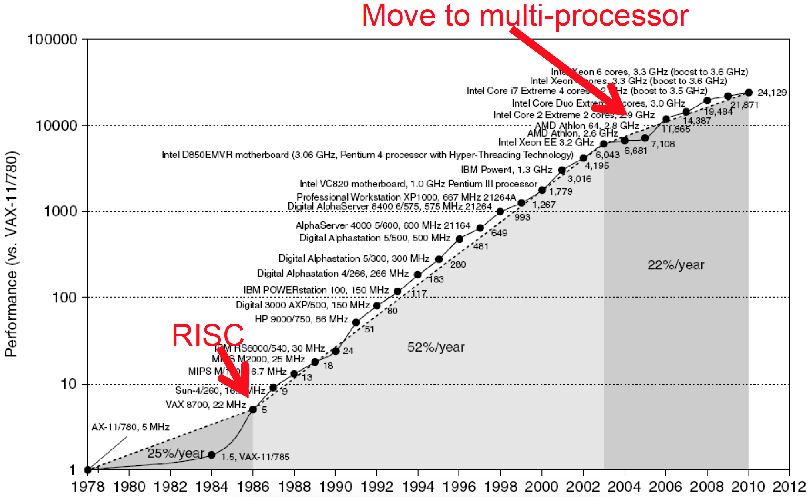

Computer Architecture is the design of the **abstraction/implementation layers** that allow us to execute information processing applications efficiently using manufacturing technologies.

As we can see below, in order to harness capabilities and features in lower levels, there are multiple layers of abstractions.

Usually, applications suggest how to improve architecture and provide revenue to fund development, whereas, technology constraints restrict what can be done efficiently and they make new architecture possible.

The middle layers provide feedback to guide applications and technology research directions.

Moore's Law says that the number of transistors in a processor doubles every 18 to 24 months. The below diagram shows the gradual growth in the performance of processor until 2012.

What's the difference between **Instruction Set Architecture** and **Microarchitecture** ?

ISA:

* Programmer visible state (memory and register)
* Operations (Instructions and how they work)
* Execution semantics (interrupts)
* I/O
* Data type/Sizes

Microarchitecture/Organization:

* Tradeoffs on how to implement ISA for some metric (speed, Energy, Cost)
* Examples: Pipeline depth, number of pipelines, cache size, silicon area, peak power, execution ordering, bus widths, ALU widths
