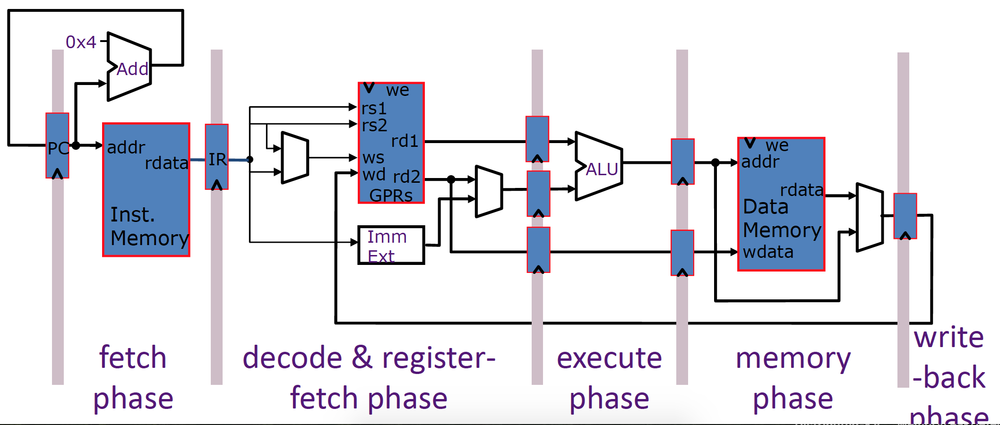
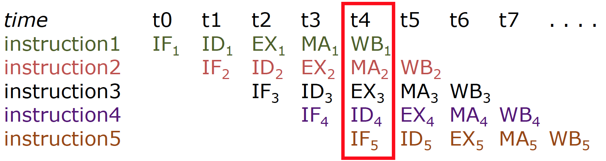
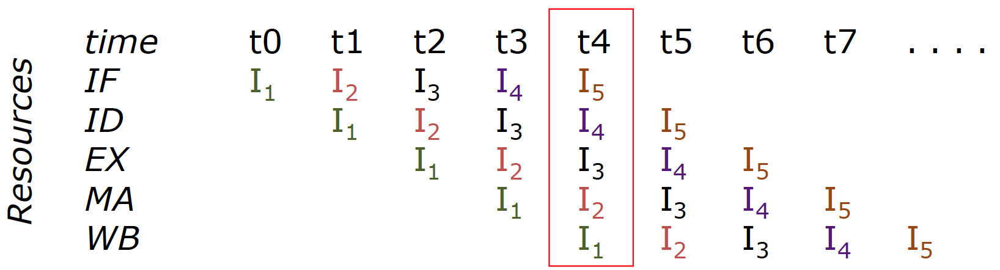
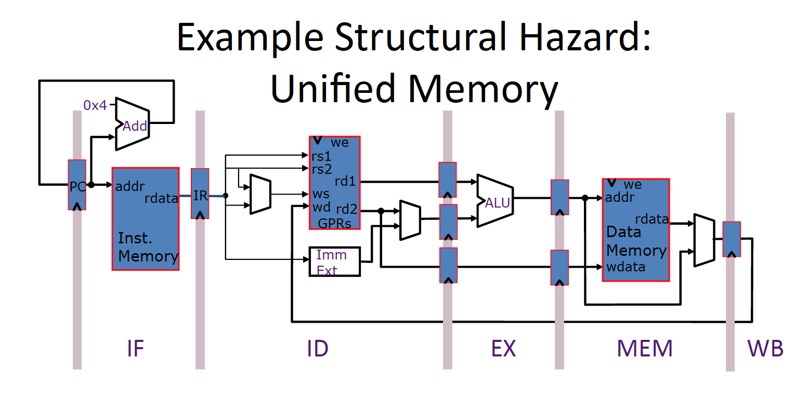
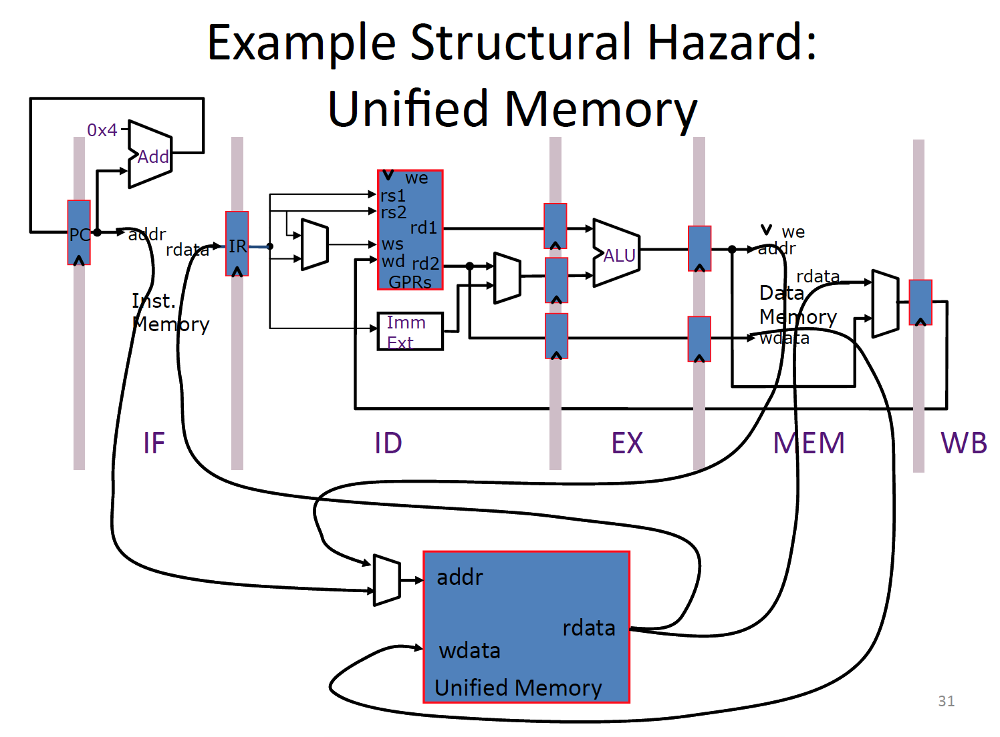
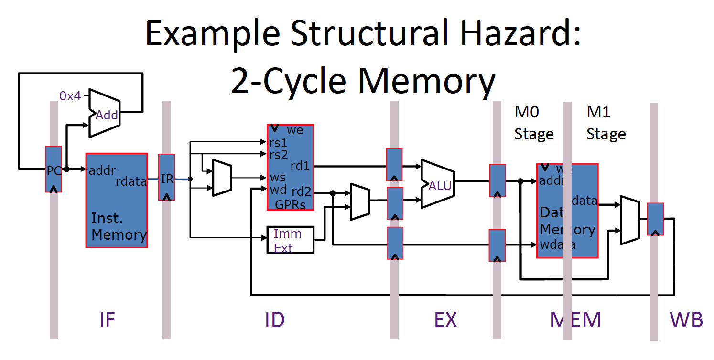
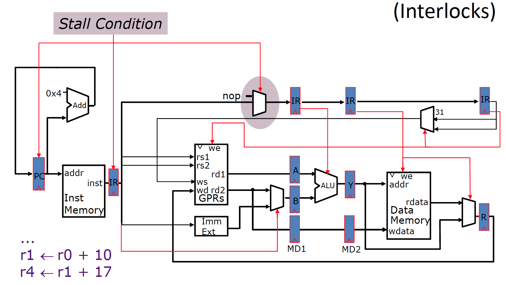
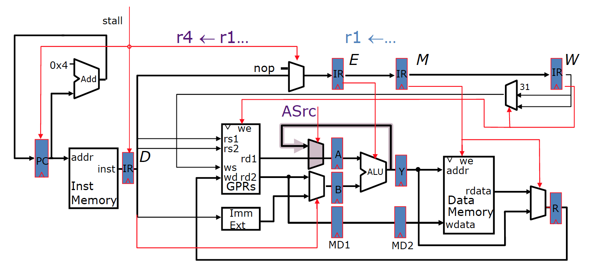

### Processor Performance
* Instructions per program depends on source code, compiler technology and ISA

* Cycles per Instructions (CPI) depends upon the ISA and the microarchitecture

* Time per cycle depends upon the microarchitecture and the base technology

### Pipeline



* **Structural Hazard** : An instruction in the pipeline needs a resource being used by another instruction in the pipeline.

Approaches to resolving this issue:
1. Schedule: Programmer explicitly avoids scheduling instructions that would create Structural hazards.
2. Stall: Hardware includes control logic that stalls until earlier instruction is no longer using contended resource.
3. Duplicate: Add more hardware to design so that each instruction can access independent resources at the same time.

For example:

|__Inst__|t0|t1|t2|t3|t4|t5|t6|t7|
|------|--------|---|---|---|---|---|---|---|
|Lw|F|D|X|__M__|W|
|ADD||F|D|X|M|W|
|ADD|||F|D|X|M|W|
|ADD||||__F__|D|X|M|W|

Therefore, we must add a stall in the forth instruction:

|__Inst__|t0|t1|t2|t3|t4|t5|t6|t7|t8|
|------|--------|---|---|---|---|---|---|---|---|
|Lw|F|D|X|__M__|W|
|ADD||F|D|X|M|W|
|ADD|||F|D|X|M|W|
|ADD||||__-__|__F__|D|X|M|W|

As another example:

|__Inst__|t0|t1|t2|t3|t4|t5|t6|t7|t8|
|------|--------|---|---|---|---|---|---|---|---|
|ADD|F|D|X|M0|M1|W|
|ADD||F|D|X|M0|__M1__|W|
|LW|||F|D|X|__M0__|M1|W
|LW||||F|D|__X__|M0|M1|W|

To address the issue:

|__Inst__|t0|t1|t2|t3|t4|t5|t6|t7|t8|t9|
|------|--------|---|---|---|---|---|---|---|---|---|
|ADD|F|D|X|M0|M1|W|
|ADD||F|D|X|M0|__M1__|W|
|LW|||F|D|X|__M0__|M1|W
|LW||||F|D|__-__|X|M0|M1|W|





* **Data Hazard** : An instruction depends on a data value produced by an earlier instruction

Data hazards occur when one instruction depends on a data value produced by a preceding instruction still in the pipeline. Approaches to resolving data hazards:
1. Schedule: Programmer explicitly avoids scheduling instructions that would create data hazards.
2. Stall: Hardware includes control logic that freezes earlier stages until preceding instruction has finished producing data value.

For example:
```
I1: r1 <- r0 - 10
I2: r4 <- r1 - r5
```
The pipeline stages for the above instructions are as below:

|t0|t1|t2|t3|t4|t5|t6|t7|t8|t9|
|--------|---|---|---|---|---|---|---|---|---|
|IF1|ID1|EX1|MA1|WB1|
|   |IF2|__ID2__|__ID2__|__ID2__|__ID2__|EX2|MA1|WB2|
|   |   |IF3|IF3|IF3|IF3|ID3|EX3|MA3|WB3|



3. Bypass: Hardware datapath allows values to be sent to an earlier stage before preceding instruction has left the pipeline



4. Speculate: Guess that there is not a problem, if incorrect, kill speculative instruction and restart.


* **Control Hazard** : Whether or not an instruction should be executed depends on a control decision made by an earlier instruction. Fundamental question is What do we need t calculate the next PC (program counter)? The answer is that it depends on the instruction that we use in each cycle. For example:
- For Jumps:
  - Opcode, offset and PC
- For Jump Register
  - Opcode and Register Value
- For Conditional Branches
  - Opcode, PC, Register (for condition), and offset
- For all other instruction
  - Opcode and PC


* Pipelining doesn't help **latency** of a single task, but it helps **throughput** of entire workload.
* Pipeline rate is limited by slowest pipeline stage.
* multiple tasks operating simultaneously.
* Unbalanced lengths of pipe stages reduces the speedup.
* Time to fill and drain the pipeline reduce the speedup.   
