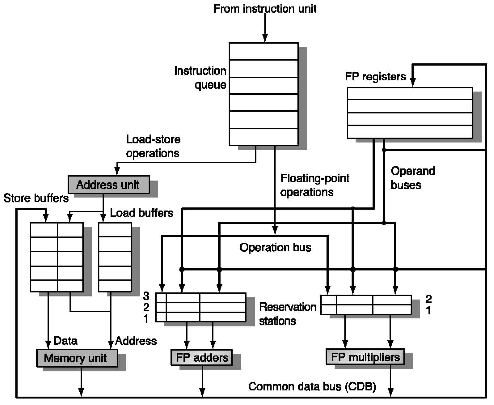

The initial idea is instead of giving the compiler the responsibility to reduce the number of stalls thereby changing the order of instructions, how will be if this responsibility is assigned to the hardware itself?
- Works when can't know real dependence at compile time.
- simpler compiler.
- code for one machine runs well on another.

Key idea is to allow instructions behind stall to proceed. This enables **Out of Order Execution** and implies **Out of Order Completion**.

Static Scheduling refers to scheduling instructions with the compiler while Dynamic Scheduling refers to scheduling with the help of the hardware in runtime.
```
DIV.D F0, F2, F4
ADD.D F10, F0, F8
SUB.D F12, F8, F14
```
7 cycle for divider and 4 cycle for the adder in the above piece of code.

|InOrder|1|2|3|4|5|6|7|8|9|10|11|12|13|14|15|16|17|18|19|20|
|-|---|---|---|---|---|---|---|---|---|---|---|---|---|---|---|---|---|---|---|---|
||F|I|D|**E**|E|E|E|E|E|E|M|W|
|||F|I|D|S|S|S|S|S|S|**E**|E|E|E|M|W|
||||F|I|D|S|S|S|S|S|S|S|S|S|**E**|E|E|E|M|W|

|Out-of-Order|1|2|3|4|5|6|7|8|9|10|11|12|13|14|15|16|
|-|-|-|-|-|-|-|-|-|-|-|-|-|-|-|-|-|
||F|I|D|**E**|E|E|E|E|E|E|M|W|
|||F|I|D|S|S|S|S|S|S|**E**|E|E|E|M|W|
||||F|I|D|**E**|E|E|E|M|W|

I stage which stands for **issue** is for controlling structural hazards and also naming dependency. Out-of-Order execution divides instruction Decode (ID) stage into two parts:
* **Issue**: decode instructions, check for structural hazards.
* **Read Operand**: wait until no data hazards, then read the operands.

Scoreboard allows instruction to execute whenever these stages are on hold, no waiting for prior instructions. In this machine WAW hazards are eliminated by renaming the registers. Scoreboard is a table maintained by the hardware. It keeps track of instructions being fetched, issued, executed etc. Hardware uses this information to dynamically schedule instructions.

## Tomasulo
Another approach for dynamic scheduling is introduced in IBM 360 in 1966 which is based on the concept of dynamic register renaming. Features of Tomasulo are as follows:
1. Control and buffers are distributed with function units(FU), in contrast with the Scoreboard with has a centralized hazard detector.
2. Registers in instructions are replaced by values or pointers to reservation station(RS), called Register Renaming.
  -  Renaming all destination Registers
  - Avoids WAR, WAW hazards.
  - More RS than registers, so can do optimizations, but compiler is not able to.

3. Results to FU from RS is not through registers but through common data bus that broadcasts results to all FUs.
4. Load and Stores are treated as FUs with RSs as well.

Key differences between Tomasulo and Scoreboard:
* Hazard detection and instruction issue is done per execution unit.
* Data results go straight to where they are needed, Common Data Bus (CDB)
* Load/Stores get their own execution units
* Use Reservation Station for renaming.

Note that, one of the most important problems in these architecture is the occurrence of **exception**. in Out-Of-Order execution and Out-Of-Order Completion CPUs, the exception is not scheduled in the correct time. So, there should be an Out-Of-Order execution but In-Order-Completion to handle the exception problems.



### Speculation

One way to address the abovementioned problem is to speculate branches. Speculative processors are based on branch predictions. it predicts the occurrence of the branch as two possibility: Taken and Not Taken. If the prediction is wrong, it rolls back the execution. In Tomasulo, we don't have precise interrupt point. Therefore, there is a need to fix the out-of-order completion aspect so that we can find precise breakpoint in instruction stream. Speculation allows an instruction to issue that is dependent on branch predicted to be taken without any consequences if branch is not actually taken. To do so, we need a hardware buffer for results of uncommitted instructions which is called **reorder buffer**.

### Multiple Issue

The goal in this architecture is to reach CPI < 1, which is issuing multiple instructions per cycle. There are two variants of this architecture:
- Superscalar
- Very Long instruction Word (VLIW):

There are multiple, independent functional units which multiple operations are placed in one instruction.

- Explicitly Parallel Instruction Computer (EPIC)

|Common Name|Issue structure|Hazard Detection|Scheduling|Distinguishing Characteristics|
|:-:|:-:|:-:|:-:|:-:|
|Superscalar(static)|Dynamic|hardware|static|in-order|
|Superscalar(dynamic)|Dynamic|hardware|dynamic|out-of-order execution without speculation|
|Superscalar(Speculative)|Dynamic|hardware|dynamic with speculation|Out-of-Order execution with speculation|
|VLIW/LIW|static|primarily software|static|all hazards are determined and indicated by the compiler|
|EPIC|primarily static|primarily software|mostly static|all hazards are determined and indicated by the compiler|
