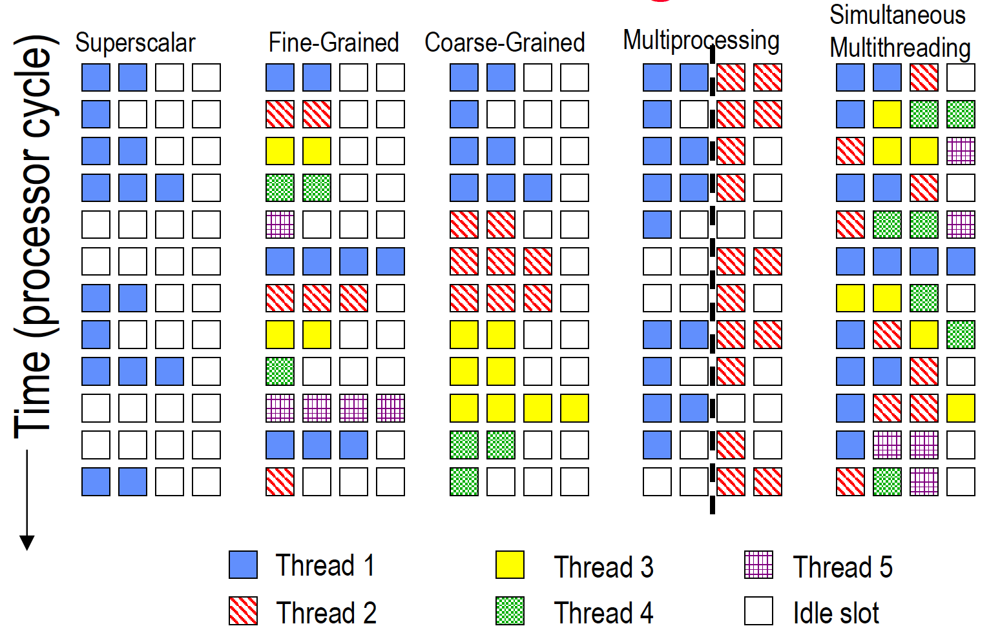

ILP exploits implicit parallel operations within a loop or straight-line code segment. TLP is explicitly represented by the use of multiple threads of execution that are inherently parallel. The goal in TLP is to use multiple instruction stream to improve throughput of computers that run many programs and execution time of multi-treaded programs. TLP could be more cost-effective to exploit than ILP. Multithreading denotes multiple threads to share functional units of 1 processor via overlapping. Processor must duplicate independent state of each thread such as separate copy of register file, a separate PC, and for running independent programs, a separate page table. One question which is arise here is that when threads must be switched?

- Alternate instruction per thread (fine grain)
- When a thread is stalled, perhaps for a cache miss, another thread can be executed (coarse grain)

* Fine-Grained Multithreading
  * Switches between threads on each instruction, causing the execution of multiples threads to be interleaved
  * Usually done in a round-robin fashion, skipping any stalled threads
  * CPU must be able to switch threads every clock
  * Advantage is it can hide both short and long stalls, since instructions from other threads executed when one thread stalls
  * Disadvantage is it slows down execution of individual threads, since a thread ready to execute without stalls will be delayed by instructions from other threads

* Coarse-Grained Multithreading
  * Switches threads only on costly stalls, such as L2 cache misses
  * Relieves need to have very fast thread-switching
  * Doesn’t slow down thread, since instructions from other threads issued only when the thread encounters a costly stall
  * hard to overcome throughput losses from shorter stalls, due to pipeline start-up costs. Since CPU issues instructions from 1 thread, when a stall occurs, the pipeline must be emptied or frozen
  * Because of this start-up overhead, coarse-grained multithreading is better for reducing penalty of high cost stalls, where pipeline refill << stall time

TLP and ILP exploit two different kinds of parallel structure in a program. Functional units are often idle in data path designed for ILP because of either stalls or dependences in the code.

