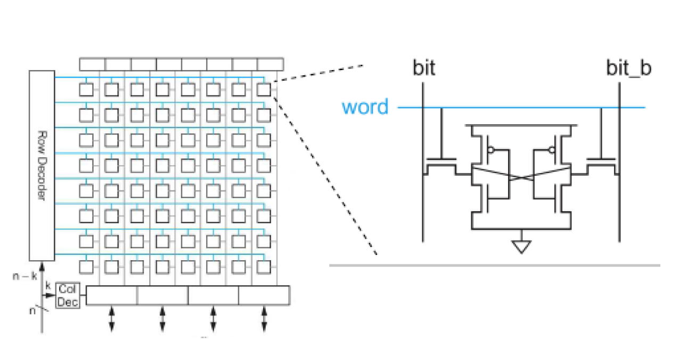
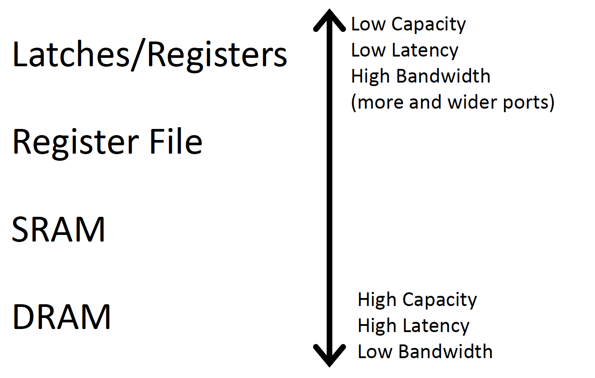
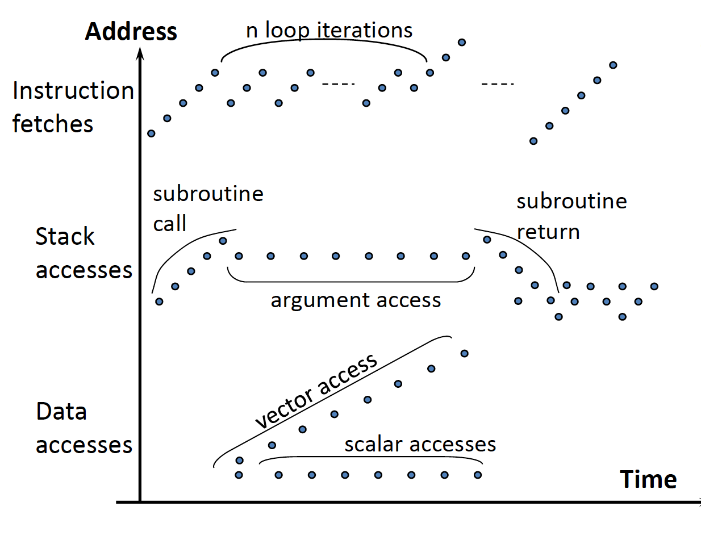
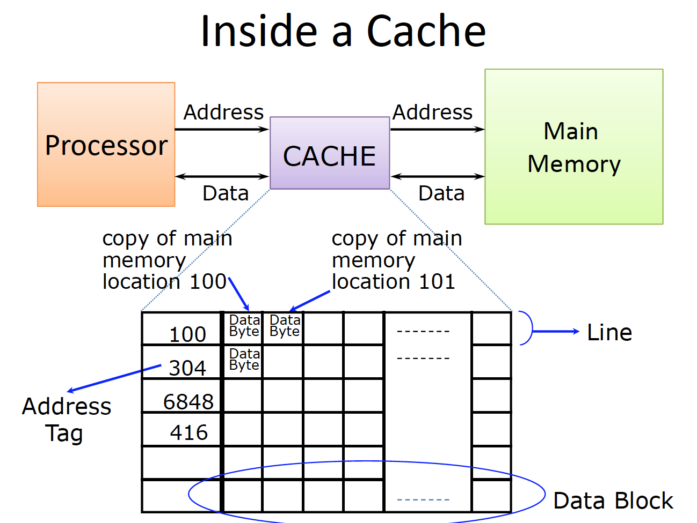
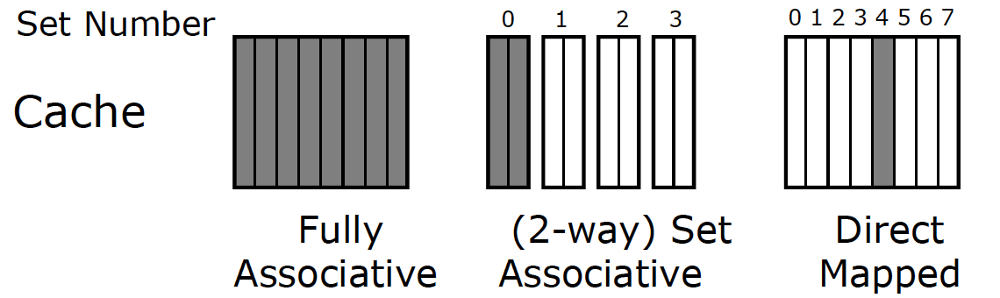
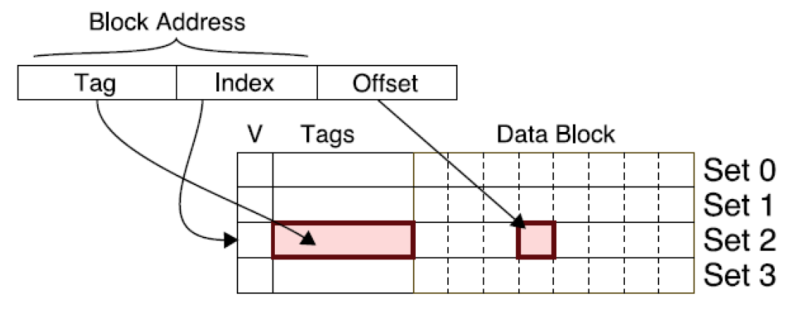
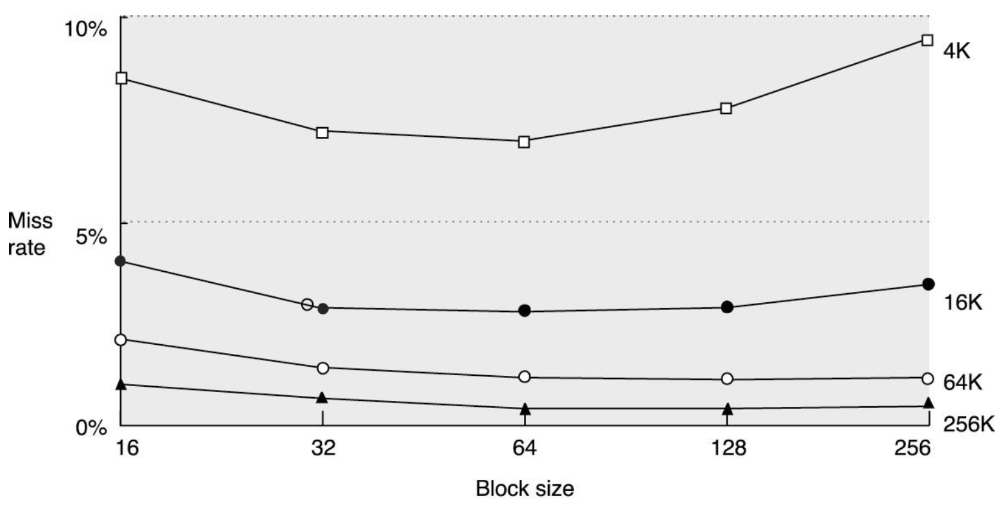

### Memory

DRAM cell:


SRAM cell:





**Temporal Locality**: If a location is reference it is likely to be referenced again in near future.

**Spatial Locality**: If a location is referenced it is likely that locations neat it will be referenced in the near future.



Performance of  high-speed computers is usually limited by memory bandwidth and latency.

Latency: time for a single access.

Bandwidth: number of access per unit time.

  - if m instructions are loads/stores, 1+m memory accesses per instruction, CPI = 1 requires at least 1+m accesses per cycle.

Bandwidth-Delay Product: amount of data that can be in flight at the same time.

It is important to note that, physical size deeply affects the latency in memory systems. In other word, physically smaller memories are faster than that of bigger ones in the same technology.



Q1: Where can a block be placed in the cache?
* Anywhere in the cache -> Fully Associative
* Direct mapped (Address mod 8)
* (m-way) Set Associative



Q2: How to find a block in the cache?
* Cache uses index and offset to find potential match, then checks tag.
* Tag check only includes higher order bits



Q3: Which block to replace?
* No choice in a direct mapped cache.
* In an Associative cache:
  - Random
  - Least Recently Used (LRU)
    - LRU cache state must be updated on every access
    - True implementation only feasible for small sets (2-way)
    - Pseudo-LRU binary tree often used for 4-8 way
  - First In, First Out (FIFO) aka Round-Robin (used highly in associative caches)
  - Not Most Recently used (NMRU)
    - FIFO with exception for most recently used blocks
Q4: How are writes handle d (Write Strategy)?
* Cache Hit
  - Write Through : write both cache and memory, generally higher traffic but simpler to design
  - Write Back : write cache only, memory is written when evicted, dirty bit per block avoids unnecessary write backs, more complicated
* Cache Miss
  - No Write Allocate: only writes to main memory
  - Write Allocate: fetch block into cache, then write

Categorizing cache miss:
1. Compulsory: First-reference to a block, occur even with infinite cache
2. Capacity: Cache is too small to hold all data needed by program, occur even under perfect replacement policy
3. Conflict: misses that occur because of collisions due to less than full associativity.

Q4: Which block should be replaced on a miss?
- Easy for Direct mapped.
- Set Associative and Fully Associative:
  - Random
  - LRU
  - FIFO
  - LFU

One idea is to make instruction and data caches separate. Instructions and data have different patterns of temporal and spatial locality. Also instructions are generally read-only. The advantage of this approach is that it doubles bandwidth between CPU & memory hierarchy and each cache can be optimized for its locality pattern.

In cache performance optimization, there are different approaches:

1. Having Larger Block Size: In this approach we keep cache size and associativity constant. In this way, we reduce Compulsory misses due to having spatial locality thereby having more accesses to a pre-fetched block. On the other hand, it may increase the probability of having capacity misses due to transferring unused data.



2. Larger Caches: In this approach, we have a fixed block size, set size etc. In this way, we have no effect on compulsory misses, but it reduces capacity misses and conflict misses.

3. Higher Associativity: It decreases conflict misses.

4. Multi-Level Caches:
```
HitTime(L1) + MissRate(L1)*(HitTime(L2) + MissRate(L2)*MissPenalty(L2))
```

5. Read Misses Take Priority

6. Avoid address translation
