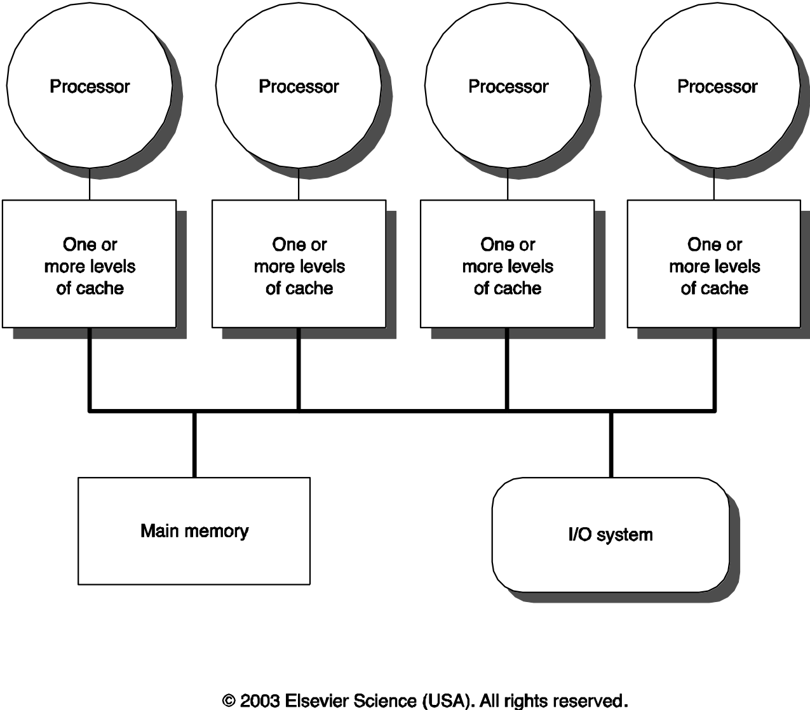

There is not much left with ILP exploitation to improve the throughput of the uni-processor systems. Multi-processor system architectures has gained lots of attention as an alternative for providing higher throughput. Taxonomy of Parallel Architecture (FLynn Classification):
* SISD (Single Instruction Single Data)
  - Uni-processors
* MISD (Multiple Instruction Single Data)
  - Multiple processors on a single data stream
  - No commercial prototypes. Can be thought of as successive refinement of a given set of data by multiple processors (units).

* SIMD (Single Instruction Multiple Data)
  - Simple programming model, low overhead, and flexibility

* MIMD (Multiple Instruction Multiple Data)
  - Use off-the-shelf microprocessors

There are two types of MIMD architecture:
1. Centralized shared-memory multiprocessors

In the above architecture, main memory has a symmetric relationship to all processors and uniform access time from any processor

  - SMP: symmetric shared-memory multiprocessors
  - UMA: uniform memory access architectures

2. Distributed-memory multiprocessors

The above architecture has two benefits: it is cost-effective to scale memory bandwidth, and it reduces local memory access time. But on the other hand, communicating data between processors is complex and has higher latency.
Two approaches for data communication:
- Shared address space (not centralized memory)
  - Same physical addr. refers to same memory location.
  - DSM: Distributed Shared-Memory Architectures
  - NUMA: Non-uniform memory access since the access time depends on the location of the data.
- Logically disjoint address space - Multicomputers

**Cache Coherence**: Any read must return the most recent write. Any write must eventually be seen by a read. All writes are seen in proper order (“serialization”). There are two classes of cache Coherence protocol:
1. Directory Based: Sharing status of a block of physical memory is kept in just one location.
2. Snooping: Every cache with copy of data also has copy of sharing status of block, but no centralized state is kept
  1. Write-Invalidate
  2. Write-Broadcast
